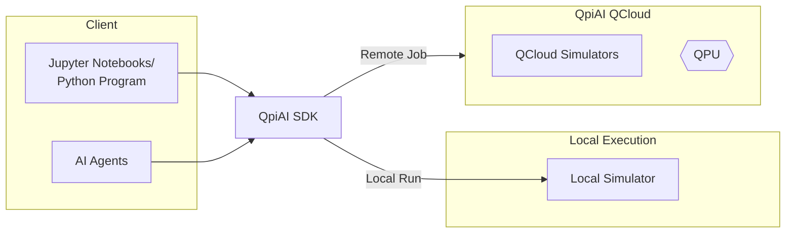

# QpiAI Quantum SDK

A comprehensive quantum computing framework with modular implementations, built for researchers, educators, and quantum application developers.

[](https://pypi.org/project/qpiai-quantum/)
[](https://pypi.org/project/qpiai-quantum/)
[](LICENSE)

## Architecture

The following diagram illustrates how QpiAI's products work together. The QpiAI Quantum SDK can execute circuits locally via built-in simulators, or submit jobs remotely to QpiAI QCloud for access to high-performance cloud simulators and QPUs.


<details>
<summary>Show Mermaid Source Code</summary>


</details>

## Features

### Core Quantum Computing
- **Circuit Building**: Intuitive quantum circuit construction with support for quantum and classical registers
- **Gate Operations**: Comprehensive set of quantum gates including:
  - Single-qubit: H, X, Y, Z, S, S†, T, T†, SX, ID
  - Rotation: RX, RY, RZ, P (phase)
  - Two-qubit: CX (CNOT), CY, CZ, SWAP, iSWAP, CP, RZZ
  - Multi-qubit: CCX (Toffoli), CSWAP (Fredkin)
- **Measurement**: Flexible measurement operations with classical register support
- **Simulation Backends**: Statevector simulator, Density matrix simulator, and Tensor network simulator
- **QPU Access**: Run circuits on QpiAI Indus quantum processing unit
- **Circuit Utilities**: Circuit depth, size, gate statistics (`list_gates`), composition (`compose`), inverse, and barrier operations

### Quantum Algorithms
- **Grover's Search**: Amplitude amplification for unstructured search
- **Shor's Algorithm**: Integer factorization
- **Quantum Fourier Transform (QFT)**: Core subroutine for many quantum algorithms
- **Quantum Phase Estimation (QPE)**: Eigenvalue estimation
- **Simon's Algorithm**: Finding hidden bit strings
- **Bernstein-Vazirani**: Determining hidden linear functions
- **Deutsch-Jozsa**: Distinguishing constant from balanced functions
- **Quantum Random Number Generator (QRNG)**: True quantum randomness
- **Amplitude Estimation**: Quantum speedup for Monte Carlo estimation (standard and iterative variants)


### Quantum Information & States
- **Statevector**: Full quantum state representation and manipulation
- **Density Matrix**: Mixed state representation with comprehensive operations
- **Entangled State Generation**: Bell states, GHZ states, W states, and Cluster states

### Visualization Tools
- **Circuit Diagrams**: Matplotlib-based circuit rendering with light/dark themes and math-text support
- **Plotly Visualizer**: Interactive circuit and result visualization
- **Bloch Sphere**: Interactive 3D Bloch sphere visualization (Plotly-based)
- **Histogram Plots**: Measurement outcome visualization
- **State Vector Plots**: Amplitude and phase visualization

### Backend & Job Management
- **Direct Execution**: Run circuits with configurable shots, device, and simulation method
- **JobManager**: Unified interface for job submission, status tracking, cancellation, and history
- **Job Result Handling**: Structured results with counts, statevectors, and density matrices

### Authentication & Cloud
- **QpiAI Cloud Authentication**: Secure access to QpiAI cloud platform and QPU resources via `QpiAIQuantumAuth`


## Installation

### PyPI Installation (Recommended)

The QpiAI Quantum SDK is available as an open-source package. Install directly from PyPI:

```bash
pip install qpiai-quantum
```

### Verify Installation

```bash
python -c 'import qpiai_quantum; print(f"QpiAI Quantum SDK v{qpiai_quantum.__version__} installed successfully")'
```

### Requirements

- Python 3.10 or higher
- Dependencies are automatically installed with pip

## Quick Start

### Basic Circuit Example

```python
from qpiai_quantum import Circuit

# Create a quantum circuit with 2 qubits and 2 classical bits
circuit = Circuit(2, 2)

# Apply quantum gates
circuit.h(0)        # Hadamard gate on qubit 0
circuit.cx(0, 1)    # CNOT gate (control: qubit 0, target: qubit 1)

# Measure qubits
circuit.measure([0, 1], [0, 1])

# Visualize the circuit
circuit.show()

print("Bell state circuit created successfully!")
```

### Authentication & API Key Setup

Before running circuits on any backend (including the local simulator), you need to authenticate with your API key:

```python
from qpiai_quantum import QpiAIQuantumAuth

# Login with your API key (obtain from https://qcloud.qpiai.tech/)
QpiAIQuantumAuth.login(api_key="your_api_key_here")

# Verify your API key
QpiAIQuantumAuth.verify_api_key()

# View available remote compute resources (Note: this does not list the local simulator)
QpiAIQuantumAuth.list_compute_resources()
```

Alternatively, set your API key in a `qcloud.env` file in your project root:

```
API_KEY="your_api_key_here"
```

### Running a Circuit on QpiAI Simulators

```python
from qpiai_quantum import Circuit

# Create a circuit
circuit = Circuit(2, 2)
circuit.h(0)
circuit.cx(0, 1)
circuit.measure([0, 1], [0, 1])

# Execute on the statevector simulator
job_result = circuit.run(shots=10000, experiment_name="Bell State", device_name="QpiAI-QSV-Local")

# Get results
counts = job_result.get_counts()
print(f"Measurement results: {counts}")
```

### Quantum Algorithms

```python
from qpiai_quantum import GroverSearch, QFT, ShorsAlgorithm

# Grover's search
grover = GroverSearch(num_qubits=3, oracle_type="custom")

# Quantum Fourier Transform
qft = QFT(num_qubits=4)

# Shor's algorithm for factorization
shor = ShorsAlgorithm(N=15)
```

### State Preparation

```python
from qpiai_quantum import BellStateGenerator, GHZStateGenerator, WStateGenerator, ClusterStateGenerator

# Generate Bell state (maximally entangled 2-qubit state)
bell_gen = BellStateGenerator(num_qubits=2)
bell_circuit = bell_gen.generate_state()

# Generate GHZ state (n-qubit entangled state)
ghz_gen = GHZStateGenerator(num_qubits=3)
ghz_circuit = ghz_gen.generate_state()

# Generate W state (n-qubit entangled state)
w_gen = WStateGenerator(num_qubits=3)
w_circuit = w_gen.generate_state()

# Generate Cluster state (graph-state entanglement)
cluster_gen = ClusterStateGenerator(num_qubits=4)
cluster_circuit = cluster_gen.generate_state()
```

### Quantum Information

```python
from qpiai_quantum import Statevector, DensityMatrix

# Create and inspect a statevector
sv = Statevector([1, 0])  # |0⟩ state

# Create a density matrix
dm = DensityMatrix([[1, 0], [0, 0]])  # |0⟩⟨0|
```

## Documentation & Tutorials

- **Tutorial Notebooks**: Explore comprehensive examples in the [`sdk_notebooks/`](https://github.com/qpiai/quantum-sdk/tree/main/sdk_notebooks/) directory.
- **[Getting Started Guide](https://github.com/qpiai/quantum-sdk/blob/main/sdk_notebooks/01_getting_started.ipynb)**: Learn the basics of quantum circuit construction
- **Documentation**: Complete SDK documentation at [https://docs.qcloud.qpiai.tech/](https://docs.qcloud.qpiai.tech/)

## Use Cases

### Research
Experiment with quantum logic gates and circuits, develop new quantum computing approaches, and prototype novel quantum applications.

### Education
Learn quantum computing concepts with practical, hands-on implementations. Perfect for students, educators, and quantum computing enthusiasts.

### Development
Build quantum applications and integrate quantum computing capabilities into your projects with a clean, intuitive API.

## Contributing

We welcome contributions from the community! Whether it's bug reports, feature requests, or questions, we'd love to hear from you.

Please see [CONTRIBUTING.md](CONTRIBUTING.md) for guidelines on:
- Reporting bugs and issues
- Requesting new features
- Contributing code
- Asking questions and getting support
- Code of conduct

## License

This project is licensed under the Apache License 2.0 - see the [LICENSE](LICENSE) file for details.

## Links & Resources

- **PyPI Package**: [https://pypi.org/project/qpiai-quantum/](https://pypi.org/project/qpiai-quantum/)
- **Documentation**: [https://docs.qcloud.qpiai.tech/](https://docs.qcloud.qpiai.tech/)
- **QpiAI QCloud Platform**: [https://qcloud.qpiai.tech/](https://qcloud.qpiai.tech/)
- **Support Email**: support@qcloud.qpiai.tech

## Citation

If you use the QpiAI Quantum SDK in your research, please cite it as follows:

```bibtex
@software{qpiai_quantum_sdk,
  author = {{QpiAI}},
  title = {QpiAI Quantum SDK},
  year = {2026},
  url = {https://github.com/qpiai/quantum-sdk},
  note = {Company Website: \url{https://www.qpiai.tech/}}
}
```

---

**Copyright © 2026 QpiAI. All rights reserved.**
